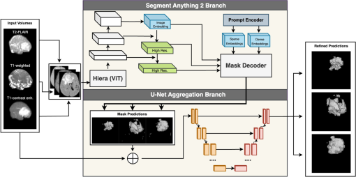

## Code for [MD-SA2: optimizing Segment Anything 2 for multimodal, depth-aware brain tumor segmentation in sub-Saharan populations](https://www.spiedigitallibrary.org/journals/journal-of-medical-imaging/volume-12/issue-02/024007/MD-SA2--optimizing-Segment-Anything-2-for-multimodal-depth/10.1117/1.JMI.12.2.024007.full). 
 
This repository is a revamp (to improve clarity, reduce bloat, and ease reproducibility) of my original code for this paper. MD-SA2 is a hybrid architecture (Segment Anything 2 + dynamic UNet w/ deep supervision) for brain tumor segmentation with low-quality MRI scans from sub-Saharan Africa, as well as a comprehensive suite of evaluation criteria & comparisons. 



## Setup

**1. System Prerequisites**
- Make sure you have at plenty of extra space available on your system (budget for ~60-70 GB to be safe if you want to visualize things) - I have written scripts that preprocess the images and store to the disk
- NVIDIA GPU with CUDA support is required for accelerated computing (mine is an RTX 3060 and has CUDA version 12.2).
- Best to use linux operating system (windows sparsely tested)

**2. Downloads**
- Clone the repo `git clone https://github.com/25benjaminli/md-sa2`
- Download the weights [here](https://drive.google.com/drive/folders/1aNFBVwMLzDVrq7z4rtE1ofvIq_U2oXtn). Expected metrics are also included in the same parent directory but separate folder for your reference.
- Visit https://www.synapse.org/Synapse:syn51156910 and make a data request for the sub-Saharan Africa dataset. Once it's downloaded, create a folder called "data" in your [base_folder] and move your dataset into there. 

From now on, replace [base_folder] with the root of this project (e.g. md-sa2). 

**2. Install dependencies**
Create a conda environment (python 3.10). Then run:
```
cd [base_folder]
pip install -r requirements.txt
cd [base_folder]/MDSA2/segment_anything_2
pip install --no-build-isolation -e .
```

**3. update your environmental variables, e.g. create a file called .env (example given below).**
```
PROJECT_PATH="/home/.../md-sa2"
DATASET_PATH="/home/.../md-sa2/data/brats_africa"
UNREFINED_VOLUMES_PATH="/home/.../md-sa2/data/unrefined_volumes_3D"
REFINED_VOLUMES_PATH="/home/.../md-sa2/data/refined_volumes_3D"
PREPROCESSED_PATH="/home/.../md-sa2/data/preprocessed"
DATA_PATH="/home/.../md-sa2/data"
```
**4. run unit tests**

Go to the unit_tests folder and run unit_tests.py. This is for preprocessing the data, testing your dataloading setup and also evaluates MD-SA2 on the selected datafold. Feel free to add your own visualization scripts or modify it to run on specific samples. The general MD-SA2 class is also included in `models.py` if you want more control.

**5. Training/Evaluation**

See [TUTORIAL.md](TUTORIAL.md) for detailed steps on how to train/evaluate the model. 


**Useful Code**
Below are some repositories/libraries that were very helpful during this study (code samples borrowed from and modified): 
- https://github.com/facebookresearch/sam2
- https://github.com/hitachinsk/SAMed
- https://github.com/Project-MONAI/MONAI

If you encounter any issues please raise them in the github repo!