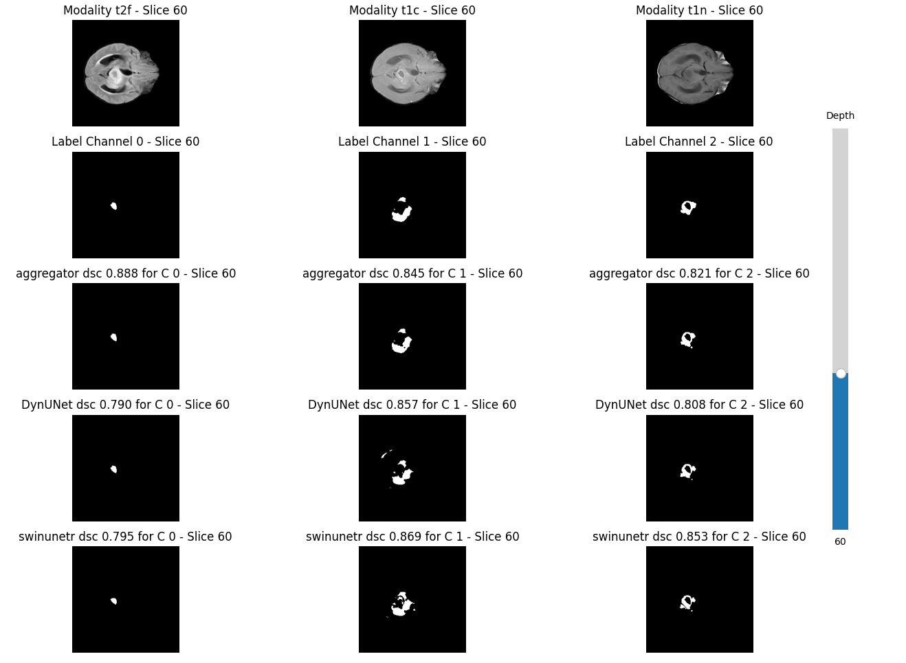

### Training

If you wish to reproduce the results of the paper, go to the train folder and run the corresponding file (train_mdsa2.py or train_unet.py). Example usage below:

```
python train_mdsa2.py --fold_val -1 --config_folder sam2_tenfold
python train_unet.py --fold_val -1 --model_type DynUNet
```

Training is governed largely by config files in the config folder but some of it is also customizable within the training script. Although the config folders are designed to make MD-SA2 compatible with any data, there needs to be more code restructuring until that can happen as most of the parameters are specific to BraTS-Africa. 

Progress can be generally tracked via tensorboard (with metrics, loss, etc) - simply open a server and track the corresponding runs folder. See the paper, the configs, and training scripts for more information on specific parameters. 

### Evaluation

Assumes you have downloaded the fine-tuned weights from the google drive or trained the models yourself. 

#### Comparisons

If you want to run baseline U-Net models, run `eval_unet.py`. The U-net models were trained with different image dimensions (too much memory consumption and time spent with higher dimensions), so ensure that you have run the following prior to running `eval_unet.py`: `python preprocess.py --overrides preprocessing.resize_dims=[224,224]`. If you intend to run MD-SA2 after running U-Net, be sure to rerun the `python preprocess.py` for the dimensions to match up (otherwise you get an error). 

Running MD-SA2 on all folds can be done by running `eval_mdsa2.py`. 

Example commands, where fold_val -1 refers to full cross-validation:

```
python eval_unet.py --weights_folder swinunetr --model_type swinunetr --fold_val -1
python eval_unet.py --weights_folder DynUNet --model_type DynUNet --fold_val -1
python eval_mdsa2.py --fold_val -1
```

#### Ablations
1. Data ablations: evaluate sa2 (tiny model) with different combos of modalities - t2f only, t1c only, t1 only, t1w only, t2f+t1c+t1
2. Model ablations: compare sa1-LoRA/sa2-b+/sa2-t/mdsa2/medsam. Only sa1-LoRA + medsam (zero-shot) are included in the file since metrics for other models can be acquired via other training steps (e.g. customize config for b+ model). 

Also, the option to use a low-rank adapted version of SA2 has been included - not originally part of the paper and sparsely tested. Based on [another repository](https://github.com/25benjaminli/sam2lora) I developed.

For further comparisons described in the paper, I have not included them in this repository to avoid too much crowding.
- View my fork of [this](https://github.com/25benjaminli/foreground-bt) repository to compile the results for the [few-shot algorithm](https://pmc.ncbi.nlm.nih.gov/articles/PMC10093064/)
- See my fork [this](https://github.com/25benjaminli/Medical-SAM-Adapter) repository to compile 
results for [Medical SAM Adapter](https://www.sciencedirect.com/science/article/pii/S1361841525000945)

#### Visualization

If you already ran the comparisons using the eval commands, then some volumes should have already accumulated in extra_software/visualization/volumes. This is based off the `volumes_to_collect.yaml` file, so adjust it if you want more volumes and then re-run the eval commands. 

Then, you can run something like `python vis_volume.py --vol 74 --fold 0 --vis_module plt` for some cool visualizations of predictions, labels, and brain volumes. A sample image is attached below: 

